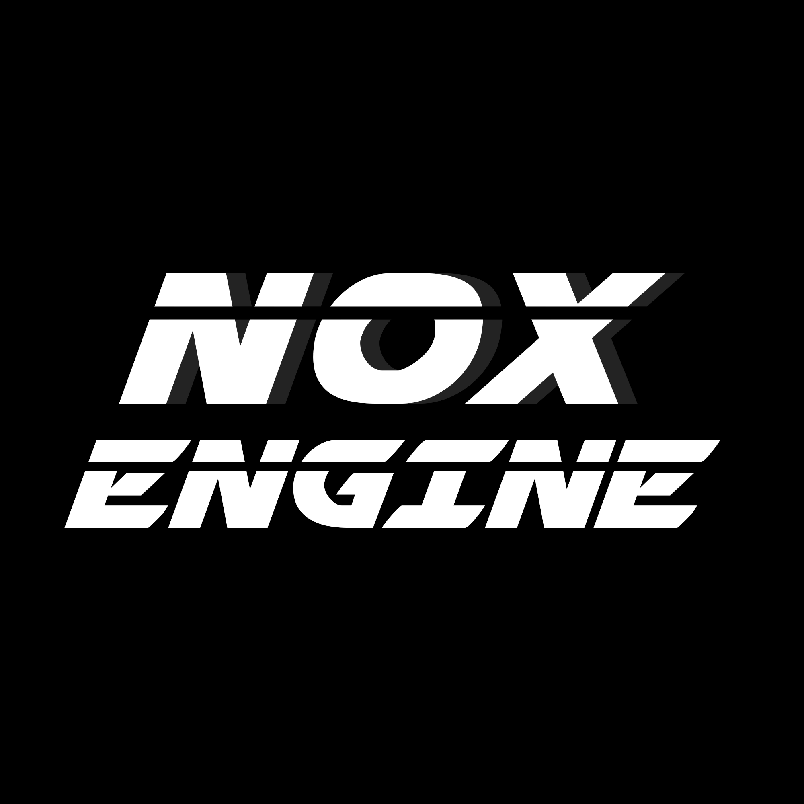

# NOX Engine



A OpenGL 4.6+ rendering engine with interesting features for real-time 3D graphics, physics simulation, and interactive scene editing.

---
## Notes
- Project was initially created during my second year at university in the 3D Graphics Programming Unit.
- Only part of the engine that remains from the original project is the Main Window,basic structure and some of the simple rendering code.
- Entire Rendering system is subject to grading for the Graphics and Computational Programming unit as it has been almost completely rewritten from scratch.
- Data Driven ECS Scene Graph/Scene Node system is subject to grading for the Game Engine Programming unit.
## Features

### Interesting Rendering Capabilities
- **Deferred Rendering Pipeline**: Efficient multi-light rendering with interesting shading
- **Path Tracing Mode**: BVH-accelerated bidirectional path tracing with temporal accumulation
  - Real-time physically accurate rendering
  - Converges over time when camera is still
  - Adjustable samples per pixel and ray bounce depth
  - Optional SVGF temporal denoising
- **Cascaded Shadow Mapping**: Cascade shadow maps for directional lights
- **Percentage Closer Soft Shadows (PCSS)**: High-quality soft shadows with hardware filtering
- **Temporal Anti-Aliasing (TAA)**: Reduces aliasing artifacts and improves image quality
- **Bloom Post-Processing**: Realistic glow effects for bright surfaces
- **PBR Material System**: Physically-based rendering with metallic and roughness parameters
- **HDR Rendering**: High dynamic range support with configurable tone mapping
- **Light Propagation Volumes (LPV)**: Global illumination using reflective shadow maps
- **Screen-Space Ambient Occlusion (SSAO)**: High-quality AO in screen space
- **Screen-Space Global Illumination (SSGI)**: Indirect lighting approximation

### Lighting System
- **Multi-Light Support**: Directional, Point, and Spot lights
- **Real-Time Shadow Mapping**: Dynamic shadow updates every frame
- **Shadow Array System**: Unified GPU buffer packing for all light types
- **Light Manager**: Efficient collection and management of scene lights
- **Configurable Light Properties**: Color, intensity, attenuation, and shadow parameters
- **Next Event Estimation (NEE)**: Direct lighting optimization for path tracing
- **Multiple Importance Sampling (MIS)**: interesting variance reduction for ray tracing
- **Image-Based Lighting (IBL)**: Environment map sampling for realistic reflections

### Physics Engine
- **Rigid Body Dynamics**: Static, Dynamic, and Kinematic body types
- **Fixed Timestep Simulation**: Stable physics at 60 Hz by default
- **Dynamic BVH Broadphase**: Efficient collision detection acceleration
- **Impulse-Based Constraint Solver**: Robust contact resolution
- **Warm Starting**: Improved stability for stacked objects
- **Sleep Management**: Performance optimization through body sleeping
- **Gizmo Manipulation**: Direct control of physics bodies via transform gizmo
- **Scene-Physics Synchronization**: Seamless integration between scene graph and physics

### Animation & Scene Management
- **glTF 2.0 Support**: Industry-standard 3D model loading
- **Skeletal Animation**: Full support for armature-based animations
- **Animation System**: Frame-based animation updates with interpolation
- **Scene Graph**: Hierarchical scene management with parent-child relationships
- **Scene Serialization**: Save and load complete scene states
- **JSON Scene Format**: Human-readable scene configuration files

### Editor Features
- **ImGui-Based Interface**: Modern, responsive editor UI
- **3D Transform Gizmo**: Visual manipulation of object transforms
- **Scene Hierarchy Browser**: Navigate and select scene objects
- **Property Inspector**: Edit object properties in real-time
- **Multiple Editor Windows**:
  - Status Window: Scene overview and quick actions
  - Camera Controls: Adjust camera parameters
  - Lighting System: Configure lights and shadows
  - Scene Hierarchy: Inspect scene graph
  - Gizmo Controls: Transform manipulation
  - Rendering Settings: Quality and performance options
  - Performance Monitor: Real-time performance metrics
  - Help & Controls: Comprehensive help system

### Performance & Debugging
- **Performance Profiler**: Frame time tracking and FPS display
- **Performance Recording**: Export frame data to CSV/JSON
- **State Export/Import**: Save and load game/editor states
- **Debug Visualization**: Optional debug drawing modes
- **Profiling Data**: Broadphase time, narrowphase time, solver time

### Input System
- **Flexible Input Mapping**: Customizable keyboard and gamepad controls
- **Multiple Input Contexts**: Global, Camera, Editor, Game, and Menu contexts
- **Mouse Lock**: Toggle mouse lock for camera control
- **Gamepad Support**: Full gamepad axis and button support
- **Action-Based System**: High-level action definitions for clean input handling

---

## Getting Started

### System Requirements
- **OS**: Windows 10/11
- **GPU**: OpenGL 4.5+ compatible graphics card
- **RAM**: 8 GB minimum, 16 GB recommended
- **Compiler**: Visual Studio 2019 or later (C++17)

### Dependencies
- OpenGL 4.5+
- GLEW 
- SDL2
- GLM 
- Dear ImGui 
- ImGuizmo 
- nlohmann JSON 
- tinyglTF (glTF 2.0 loader)


## Usage Guide

### Basic Controls

#### Camera Controls
- **WASD**: Move camera forward/backward/left/right
- **Mouse**: Look around (when mouse is unlocked)
- **Scroll Wheel**: Zoom in/out
- **Shift+Click**: Toggle mouse lock

#### Transform Gizmo
- **Q**: Translate mode
- **E**: Rotate mode
- **R**: Scale mode
- **G**: Toggle gizmo visibility
- **Left Mouse**: Drag to manipulate

#### Window Management
- **F1**: Engine Status window
- **F2**: Camera Controls window
- **F3**: Lighting System window
- **F4**: Scene Hierarchy window
- **F5**: Gizmo Controls window
- **F6**: Rendering Settings window
- **F7**: Performance Monitor window
- **F12**: Help & Controls window

### Creating a Scene

Create a JSON scene file in the `scenes/` directory:

```json
{
  "scene_name": "My Scene",
  "exposure": 1.0,
  "gamma": 2.2,
  "physics_enabled": true,
  "nodes": [
    {
      "name": "Cube",
      "type": "mesh",
      "position": [0, 0, 0],
      "rotation": [0, 0, 0],
      "scale": [1, 1, 1],
      "model_path": "models/cube.gltf",
      "physics": {
        "type": "dynamic",
        "mass": 1.0,
        "collider": {
          "type": "box",
          "size": [1, 1, 1]
        }
      }
    }
  ],
  "lights": [
    {
      "name": "DirectionalLight",
      "type": "directional",
      "position": [10, 10, 10],
      "direction": [-1, -1, -1],
      "intensity": 1.0,
      "color": [1, 1, 1],
      "shadows_enabled": true
    }
  ]
}
```

### Configuring the Engine

Edit `config.json` to customize engine settings:

```json
{
  "windowWidth": 1920,
  "windowHeight": 1080,
  "windowTitle": "NOX Engine",
  "vsync": false,
  "first_scene": "scenes/gundam.json",
  "camera": {
    "position": [-1.0, 1.0, -1.0],
    "fov": 120,
    "near": 0.1,
    "far": 600.0,
    "movement_speed": 30.0,
    "mouse_sensitivity": 0.1
  },
  "light": {
    "shadows_enabled": true,
    "shadow_size": 2048,
    "cascade_count": 4,
    "pcf_samples": 25
  },
  "physics": {
    "gravity": [0.0, -9.81, 0.0],
    "fixed_delta_time": 0.01667,
    "max_substeps": 4
  }
}
```

---

## Architecture

### Core Subsystems

#### Rendering System (ModularRenderer)
- Multi-pass rendering pipeline
- G-Buffer geometry pass
- Lighting pass with shadow mapping
- Post-processing effects
- ImGui overlay rendering

#### Physics Engine
- RigidBody physics simulation
- Dynamic BVH for broadphase
- Contact manifold narrowphase
- Impulse-based constraint solver
- Scene synchronization

#### Scene Management
- SceneGraph hierarchical structure
- SceneLoader for JSON deserialization
- SceneNode with ECS entity linking
- Model and animation management

#### Input System (InputIntegration)
- Action-based input mapping
- Multiple input contexts
- Keyboard and gamepad support
- Mouse lock management

#### Lighting System (LightManager)
- Light collection and management
- Shadow atlas generation
- GPU buffer packing
- Multi-light rendering support

### Key Classes

| Class | Purpose |
|-------|---------|
| `Core` | Main engine coordinator |
| `ModularRenderer` | Rendering pipeline |
| `PhysicsEngine` | Physics simulation |
| `SceneGraph` | Scene hierarchy |
| `Camera` | View frustum and projection |
| `DirectionalLight` | Cascaded shadow mapping |
| `LightManager` | Multi-light management |
| `InputIntegration` | Input handling |
| `ImGuiInterface` | Editor UI |

---

## Project Structure

```
Nox_Engine/
├── src/
│   ├── Core.h/.cpp                 # Main engine coordinator
│   ├── ModularRenderer.h/.cpp      # Rendering pipeline
│   ├── PhysicsEngine.h/.cpp        # Physics simulation
│   ├── SceneGraph.h/.cpp           # Scene management
│   ├── SceneLoader.h/.cpp          # Scene serialization
│   ├── Camera.h/.cpp               # Camera system
│   ├── Lighting/
│   │   ├── DirectionalLight.h/.cpp
│   │   ├── LightManager.h/.cpp
│   │   └── LightNode.h/.cpp
│   ├── Physics/
│   │   ├── RigidBody.h/.cpp
│   │   ├── PhysicsCollision.h/.cpp
│   │   └── PhysicsBVH.h/.cpp
│   ├── Input/
│   │   ├── InputIntegration.h/.cpp
│   │   └── InputSystem.h/.cpp
│   └── ImGui/
│       ├── ImGuiInterface.h/.cpp
│       ├── ImGuiWindowManager.h/.cpp
│       └── Windows/
│           ├── StatusWindow.h/.cpp
│           ├── CameraWindow.h/.cpp
│           ├── LightingWindow.h/.cpp
│           └── ...
├── shaders/                        # GLSL shader programs
├── scenes/                         # Scene JSON files
├── models/                         # 3D model assets
├── fonts/                          # Font files
├── config.json                     # Engine configuration
└── Nox_Engine.sln                  # Visual Studio solution
```

---

## Rendering Pipeline

### Multi-Pass Rendering (Deferred Mode)

1. **Shadow Pass**: Render to shadow atlas for all lights
2. **G-Buffer Pass**: Render scene to deferred buffers (Position, Normal, Albedo, etc.)
3. **Lighting Pass**: Combine lights with shadow mapping
4. **Global Illumination**: LPV or SSGI for indirect lighting
5. **Post-Processing**:
   - Temporal Anti-Aliasing
   - Bloom extraction and blur
   - Tone mapping and color grading
6. **UI Overlay**: ImGui windows and 3D gizmo

### Cascaded Shadow Mapping
- 4-level cascade splits
- Configurable cascade distribution
- PCSS soft shadow filtering
- PCF for hardware filtering

### Path Tracing Pipeline (Alternative Mode)

1. **BVH Construction**: Build acceleration structure from scene
2. **Ray Generation**: Primary rays from camera
3. **Ray Tracing**: Trace rays through BVH hierarchy
4. **Shading**: Evaluate materials and indirect lighting
5. **Denoising**: Apply SVGF filter if enabled
6. **Temporal Accumulation**: Blend with previous frames
7. **Post-Processing**: Bloom and tone mapping
8. **UI Overlay**: ImGui windows and 3D gizmo

---

## Path Tracing System

### Overview
NOX Engine features a high-performance path tracing renderer with BVH acceleration and interesting denoising. Path tracing provides physically accurate global illumination and reflections, converging to photorealistic quality over multiple frames.

### Path Tracing Features
- **BVH-Accelerated Raytracing**: Rapid rayTraversal using hierarchical bounding volumes
- **Bidirectional Path Tracing**: Light and camera path sampling for improved convergence
- **Temporal Accumulation**: Multi-frame accumulation for noise reduction
- **Adaptive Sampling**: Configurable samples per pixel for quality vs performance tradeoff
- **Next Event Estimation (NEE)**: Direct light sampling for faster convergence
- **Multiple Importance Sampling (MIS)**: Variance reduction for better sample efficiency
- **Depth-based Ray Tracing**: Depth-aware ray intersection testing

### Denoising Pipeline
- **SVGF (Spatiotemporal Variance-Guided Filtering)**:
  - Temporal filtering for multi-frame smoothing
  - Variance clipping for artifact reduction
  - Depth and normal thresholding for edge preservation
  - A-Trous filtering for progressive detail recovery
  - Configurable filter iterations and parameters

### Configuration Parameters

```json
"path_tracing": {
  "samples_per_pixel": 4,
  "max_ray_bounces": 4,
  "resolution_scale": 1.0,
  "enable_accumulation": true,
  "enable_denoising": true,
  "enable_nee": true,
  "enable_mis": true,
  "enable_ibl": true,
  "ibl_intensity": 1.0,
  "denoising": {
    "temporal_alpha": 0.15,
    "variance_clip_gamma": 1.5,
    "depth_threshold": 0.05,
    "normal_threshold": 0.9,
    "atrous_iterations": 4,
    "phi_color": 5.0,
    "phi_normal": 32.0,
    "phi_depth": 0.01
  }
}
```

### Usage
1. Open the Rendering Settings window (F6)
2. Switch "Renderer Mode" to "Path Traced"
3. Adjust samples per pixel and max bounces
4. Keep camera still for convergence
5. Enable SVGF denoising for faster visual quality

### Performance Tips
- Use 1-4 samples per pixel for interactive preview
- Reduce resolution scale (0.5 = 4x faster) for real-time exploration
- Enable denoising for cleaner results with fewer samples
- Use 4-8 ray bounces for most scenes
- Set NEE and MIS for faster convergence

---

## Physics Configuration

### Simulation Parameters (config.json)

```json
"physics": {
  "gravity": [0.0, -9.81, 0.0],
  "fixed_delta_time": 0.01667,
  "max_substeps": 4,
  "velocity_iterations": 10,
  "position_iterations": 4,
  "sleep_enabled": true,
  "default_friction": 0.5,
  "default_restitution": 0.0
}
```

### Body Types
- **Static**: Infinite mass, doesn't move
- **Dynamic**: Simulated with forces and constraints
- **Kinematic**: Controlled by scene, no physics simulation

---

## Animation System

### Supported Formats
- glTF 2.0 animations
- Skeletal animation with bone transforms
- Multiple animation tracks per model

### Animation Features
- Frame-based interpolation
- Blending between states
- Animation callbacks
- Root motion support

---

## Performance Optimization

### Built-In Optimizations
- **BVH Acceleration**: Hierarchical spatial queries
- **Frustum Culling**: GPU-based frustum culling in geometry shader
- **Shadow Atlas**: Unified texture array for all shadow maps
- **Instanced Rendering**: MDI (Multi-Draw Indirect) for batch rendering
- **Body Sleeping**: Physics bodies sleep when stationary
- **Temporal Effects**: TAA with history buffer reuse

### Configuration Tips
1. Reduce shadow map resolution for lower-end GPUs
2. Disable PCSS for better performance
3. Adjust cascade count (3-4 typical)
4. Reduce PCF sample count (16-25)
5. Use object pooling for frequently created objects

---

## Debugging

### Debug Windows
- **Performance Monitor**: View frame times and statistics
- **Scene Hierarchy**: Inspect scene graph structure
- **Gizmo Controls**: Verify transform manipulations
- **Console Output**: Check for errors and warnings

### Debug Features
- Light priority selection debugging
- Contact information logging
- Physics body state inspection
- Transform synchronization tracking

---

## Scene File Format

### JSON Schema

```json
{
  "scene_name": "string",
  "exposure": "float",
  "gamma": "float",
  "physics_enabled": "boolean",
  "nodes": [
    {
      "name": "string",
      "type": "mesh|light|audio|camera|empty",
      "position": [x, y, z],
      "rotation": [x, y, z],
      "scale": [x, y, z],
      "model_path": "string (optional)",
      "physics": { /* physics component */ },
      "children": [ /* nested nodes */ ]
    }
  ],
  "lights": [ /* light definitions */ ]
}
```

---

## Extending the Engine

### Adding a Custom Renderer Pass

```cpp
class MyCustomPass : public RenderPass {
    void Render(const SceneGraph& scene, const Camera& camera) override;
    void Resize(int width, int height) override;
};
```

### Creating Custom Physics Bodies

```cpp
auto body = std::make_shared<RigidBody>();
body->SetBodyType(RigidBody::BodyType::Dynamic);
body->setSphere(1.0f);  // Sphere with radius 1.0
physicsEngine->AddBody(body);
```

### Custom Input Actions

```cpp
inputSystem->RegisterAction(Input::Actions::CUSTOM_ACTION, 
    InputBinding(SDL_SCANCODE_T, InputModifier::NONE));
```

---

## Documentation

- **Help Window**: Press F12 in-engine for comprehensive help
- **Code Comments**: Extensive documentation in source code
- **Example Scenes**: Multiple pre-built scenes in `scenes/` directory
- **Config Files**: Well-documented JSON configuration


## Acknowledgments

- **GLEW**: OpenGL Extension Wrangler Library
- **SDL2**: Simple DirectMedia Layer
- **GLM**: OpenGL Mathematics
- **Dear ImGui**: Immediate Mode GUI
- **ImGuizmo**: Transform Gizmo for ImGui
- **nlohmann/json**: JSON for Modern C++
- **tinyglTF**: glTF 2.0 loader